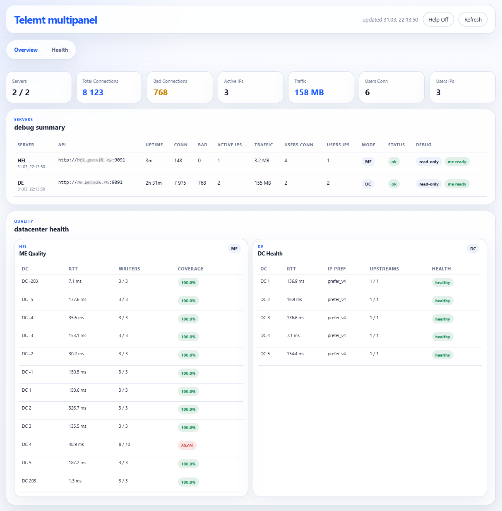

# Telemt Multipanel

Панель для агрегации метрик `telemt` с нескольких серверов.



### Что есть:
- backend на `Go`;
- один TOML-конфиг;
- параллельный опрос нескольких `telemt` API;
- агрегированный snapshot;
- light debug UI без внешней frontend-сборки;
- Docker-сборка в один контейнер.

## Quick Start

Предполагается, что `Docker` и `docker compose` уже установлены.

1. Создать рабочую папку:

```bash
sudo mkdir -p /opt/multipanel
sudo chown -R "$(id -un)":"$(id -gn)" /opt/multipanel
```

2. Скачать репозиторий:

```bash
git clone https://github.com/poznik/multipanel.git /opt/multipanel
cd /opt/multipanel
```

3. Добавить актуальный контейнер в Docker:

```bash
docker load -i release/multipanel-prod-image.tar.gz
```

4. Скопировать конфиг:

```bash
cp config.example.toml config.toml
```

5. Поправить конфиг:

```bash
nano config.toml
```

6. Запустить контейнер без билда:

```bash
docker compose up -d --no-build
```

## Локальный запуск

```bash
cp config.example.toml config.toml
# отредактируйте точки telemt

go run . --config config.toml
```

Панель будет доступна на `http://0.0.0.0:8082`.
Панель не имеет авторизации или иной защиты. Защитите порт средствами UFW/иного брандмауэра.


## Конфиг

```toml
[server]
listen = "0.0.0.0:8082"
refresh_interval = "10s"
request_timeout = "5s"

[telemt]
allow_insecure_tls = false

[[telemt.endpoints]]
name = "ams-1"
scheme = "http"
address = "telemt-1.example.net"
port = 2398
auth_header = ""

[[telemt.endpoints]]
name = "ams-2"
scheme = "http"
address = "telemt-2.example.net"
port = 2398
auth_header = ""
```

Поддерживаются:
- несколько endpoints;
- `http` и `https`;
- опциональный `Authorization` header для каждого endpoint;
- включение/отключение endpoint через `enabled = false`.

## Что Показывает UI

- суммарные метрики по всем серверам;
- таблицу по каждому серверу;
- `ME/CD mode`;
- `ME Quality` по DC: `RTT`, `Writers`, `Coverage`;
- статус доступности API и ошибки отдельных endpoint-запросов.

Примечание:
- `Total traffic` в текущей версии считается по пользовательским octet counters из `/v1/users`.
